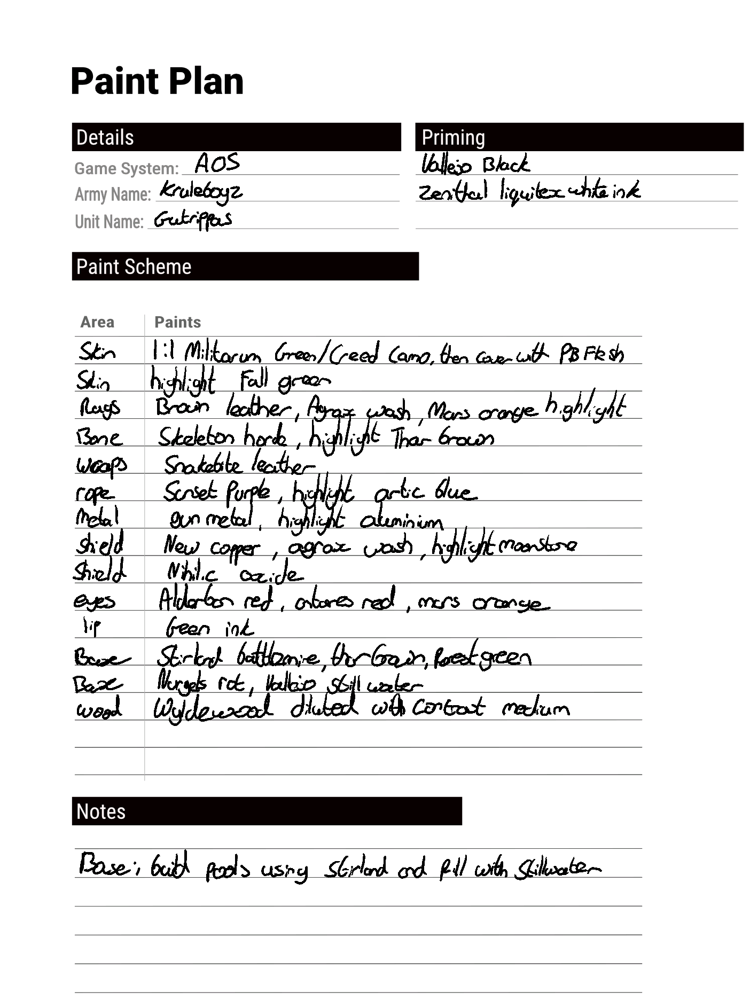

# Paint Plan

A template for logging paints used when painting models/minatures etc.
Upload PaintPlan.svg and PaintPlan.png to your remarkable following the steps [here ](https://remarkablewiki.com/tips/templates)

The Covers folder contains several templates that can be used to create a front cover for your paint journal. Upload to your remarkable in the same manner, create a new notebook using the PaintPlan template then change the template on the first page, using the layers option, to the required cover.

## Example Paint Plan

